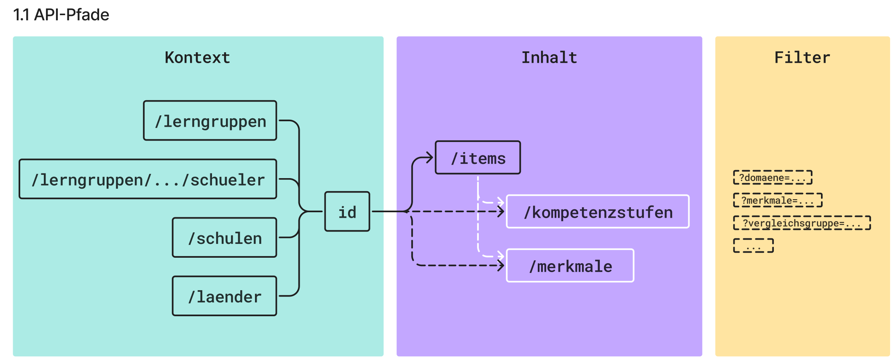
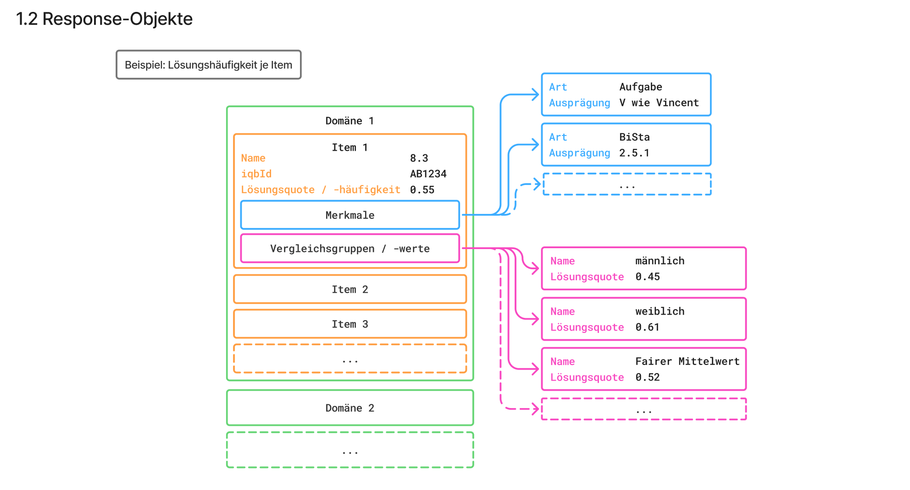
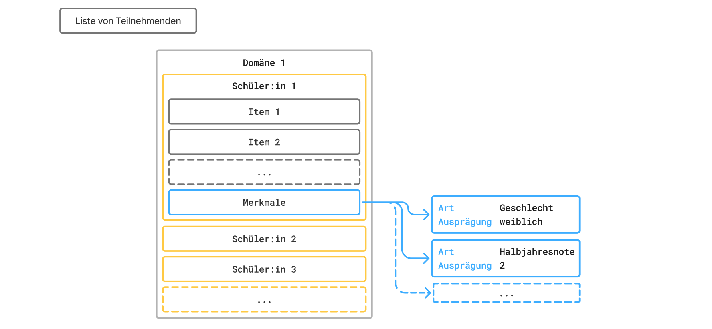
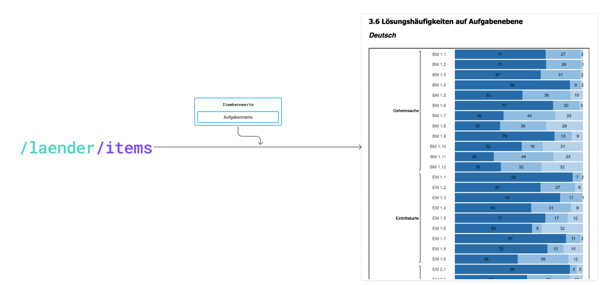
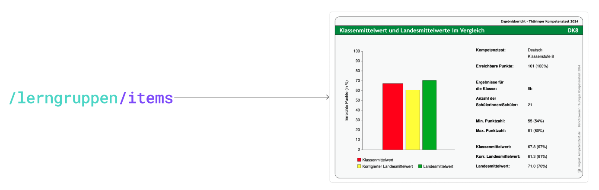
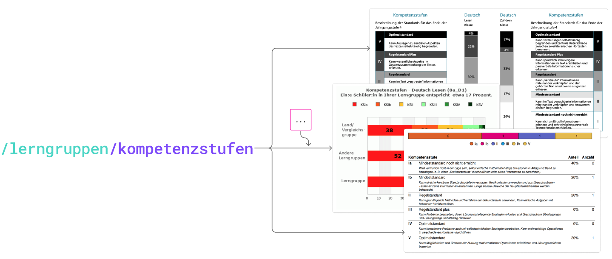
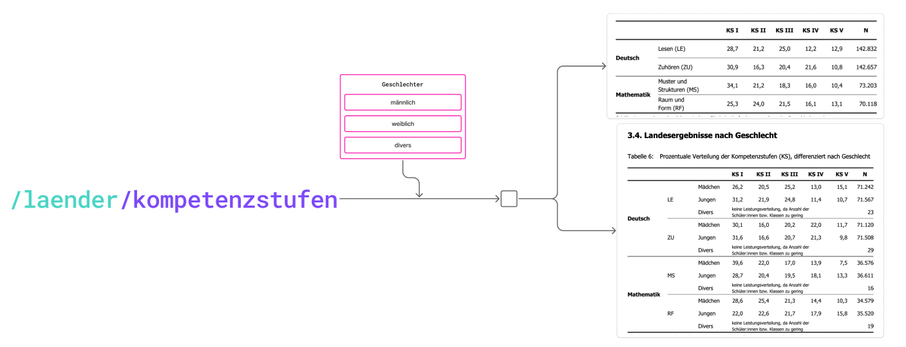
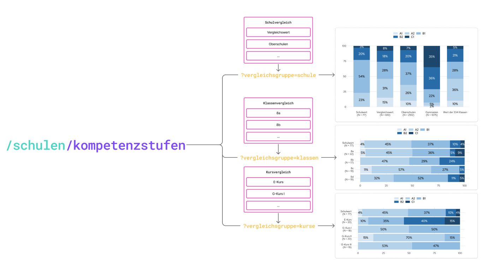
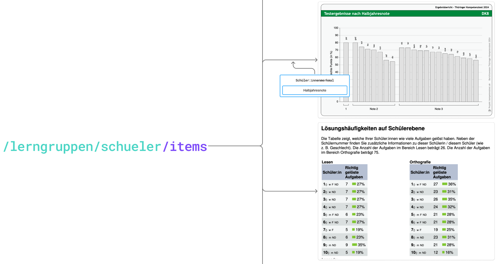
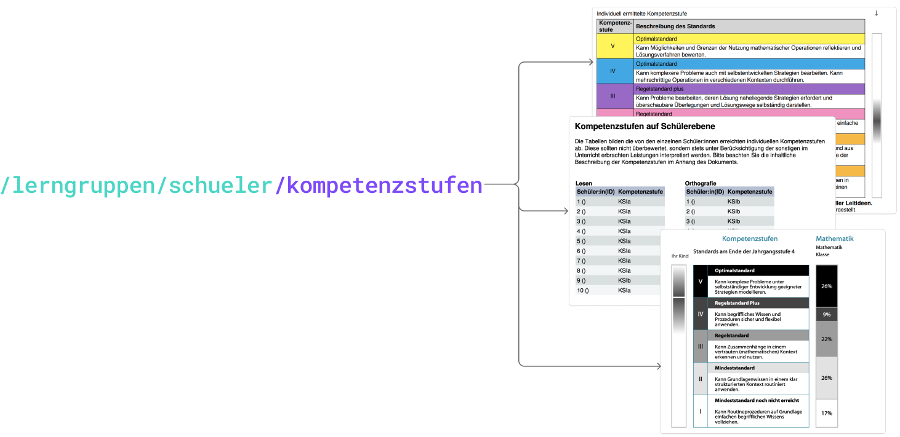

# TBA 3 Auswertungsschnittstelle

In diesem Repository befindet sich - aktuell im Vorschlag- und Entwurfsstadium - die Spezifikation der gemeinsamen Auswertungsschnittstelle im TBA3-Projekt.

## Spezifikation lesen

Die Datei [`tba3-spec.yml`](./tba3-spec.yml) ist eine im OpenAPI 3.1-Format geschriebene Spezifikation für die Schnittstelle. Am einfachsten kann sie in der Swagger UI betrachtet werden, z.B. über diesen Link: [Spezifikation Auswertungsschnittstelle (in der Swagger UI)](https://petstore.swagger.io/?url=https%3A%2F%2Fraw.githubusercontent.com%2Findibit-eu%2Ftba3%2Frefs%2Fheads%2Fmain%2Ftba3-spec.yml).

## Aufbau

## Nutzungsbeispiele

