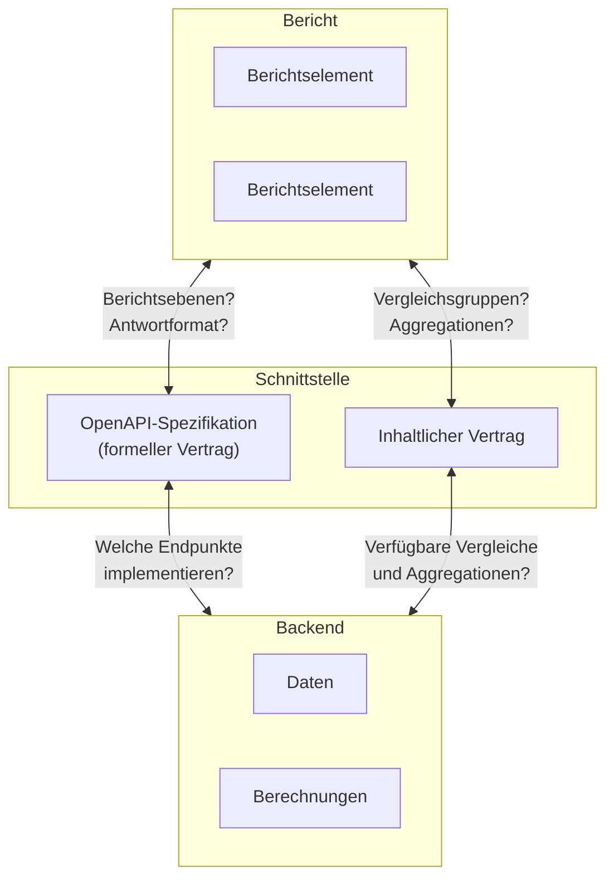

# TBA3-Auswertungsschnittstelle: Konzepte und Architektur

Die TBA3-Auswertungsschnittstelle definiert ein gemeinsames Datenformat,
mit dem Berichtselemente (UI-Komponenten) zwischen verschiedenen Projektpartnern ausgetauscht werden können,
ohne dass sie für jedes Backend neu entwickelt werden müssen.

---

## Ziel: Austauschbare Berichtslemente

"Austauschbar" bedeutet: Ein Berichtselement funktioniert mit den Daten anderer TBA3-konformer Backends.
Im Optimalfall unabhängig davon, welcher Partner das Backend entwickelt hat, in welchem Bundesland es eingesetzt wird
oder wie die zugrundeliegenden Berechnungen intern funktionieren.

Idealerweise kennt ein Berichtselement nur die TBA3-OpenAPI Spezifikation. Es bekommt Daten in einem definierten Format und zeigt sie an.
Die restlichen Fragen - welcher Kontext? welche Vergleichswerte? welche Aggregation? - steuert der aufrufende Bericht und gibt diese Informationen in das Berichtselement hinein.

---

## Rolle der Spezifikation



| Schicht                  | Kennt                                                                                                       | Verantwortlich dafür...                                                                                                                  |
|--------------------------|-------------------------------------------------------------------------------------------------------------|------------------------------------------------------------------------------------------------------------------------------------------|
| **Bericht**              | eingeloggter Benutzer, Stammdaten, Fähigkeiten des Backends                                                 | die richtigen Requests zusammenzubauen oder Kontextinformationen an Berichtselemente zu geben; braucht Informationen über BEIDE Verträge |
| **Berichtselement**      | OpenAPI-Spec (Antwortformat, Datentypen)                                                                    | Daten/Kontextinformationen entgegenehmen und darstellen; braucht idealerweise nur die OpenAPI-Spezifikation                              |
| **OpenAPI-Spec**         | Endpunkte, Antwortformat, Datentypen                                                                        | ein einheitliches Datenformat zu spezifizieren, das für alle Backends und Frontends als gemeinsame Basis dient                           |
| **Inhaltlicher Vertrag** | Fähigkeiten Backend, Darstellungen Frontend, z.B. für Vergleichsgruppen, Aggregationen, Query-Param-Formate | die offenen Punkte der Schnittstelle inhaltlich auszugestalten                                                                           |
| **Backend**              | Eigene Daten, eigene Berechnungen                                                                           | Endpunkte implementieren, Parameter verarbeiten, Berechnungen durchführen, spec-konforme Responses ausliefern                            |

**OpenAPI-Spezifikation (formeller Vertrag):** Regelt die *Struktur* der Schnittstelle. Welche Endpunkte es gibt,
welche Felder eine Response hat und welche Datentypen diese haben.
Ein Berichtselement muss theoretisch nur diesen Vertrag kennen, um mit jedem TBA3-konformen Backend zu funktionieren.

**Inhaltlicher Vertrag:** Regelt die *Semantik* der Fragen, die die Spezifikation offen lässt.
Welche Vergleichsgruppen das Backend anbieten kann, welche Aggregationsarten unterstützt werden und wie die Parameter-Werte dafür formatiert sein müssen.
Dieser Vertrag ist systemspezifisch und wird nicht von der OpenAPI-Spec abgedeckt. Der Bericht muss ihn kennen, um die richtigen Requests zusammenzubauen.

Diese Zweiteilung wirft die Frage auf, wie weit der inhaltliche Vertrag standardisiert werden kann und welche Konsequenzen das für Flexibilität und Austauschbarkeit hat.

---

## Was die Spezifikation regelt

### Gemeinsame Endpunkte

Die Spec definiert eine 3×3-Matrix aus Berichtsebenen und Ergebnisdaten:

| | Kompetenzstufen | Items | Aggregationen |
|---|---|---|---|
| **Lerngruppe** | `GET /groups/{id}/competence-levels` | `GET /groups/{id}/items` | `GET /groups/{id}/aggregations` |
| **Schule** | `GET /schools/{id}/competence-levels` | `GET /schools/{id}/items` | `GET /schools/{id}/aggregations` |
| **Land** | `GET /states/{id}/competence-levels` | `GET /states/{id}/items` | `GET /states/{id}/aggregations` |

Jede Kombination ist ein eigener Endpunkt. Alle liefern dasselbe Grundformat zurück: ein Array von Value-Groups.

### Gemeinsames Datenformat: Die Value-Group

Die Value-Group ist der universelle Container der Spec. Alle Endpunkte liefern Arrays von Value-Groups zurück. Was eine einzelne Value-Group repräsentiert, hängt vom Kontext ab:

- Eine Lerngruppe (z.B. "Klasse 8a")
- Ein:e einzelne:r SuS (z.B. "Schüler 1")
- Eine Schule oder ein Bundesland
- Einen Vergleichswert (z.B. "Korrigierter Landesmittelwert")
- Eine Teilgruppe nach Kovariate (z.B. "Mädchen in Klasse 8a")

Jede Value-Group hat dieselbe Grundstruktur:

```
Value-Group
├── id           (optional) — Eindeutige Kennung
├── name         (Pflicht)  — Bezeichnung, z.B. "Klasse 8a"
├── domain       (optional)
│   ├── id       (optional)
│   └── name     (Pflicht) — z.B. "Leseverstehen"
├── subject      (optional)
│   ├── id       (optional)
│   └── name     (Pflicht) — z.B. "Deutsch"
├── covariates   (optional) — Kovariaten der Value-Group (Geschlecht, Sprache, ...)
├── properties   (optional) — Freie Key-Value-Metadaten
│
└── ... Ergebnisdaten (je nach Endpunkt)
    ├── competenceLevels[]   ← bei /competence-levels
    ├── items[]              ← bei /items
    └── aggregations[]       ← bei /aggregations
```

Die Ergebnisdaten im unteren Teil der Value-Group sind endpunktspezifisch — eine Value-Group enthält immer genau einen dieser drei Typen.
Covariates und Properties sind Erweiterungspunkte, über die systemspezifische Kontextdaten transportiert werden können.

---

## Was die Spec bewusst nicht regelt

- **Stammdaten**: Welche Klassen, Schulen oder Lerngruppen es gibt; welche Testheftzusammensetzungen vorliegen
- **Authentifizierung**: Wie sich ein Frontend beim Backend authentifiziert

---

## Offenheit vs. Standardisierung

Die Spannung zwischen den beiden Teilen der Schnittstelle zeigt sich vor allem beim **inhaltlichen Vertrag**:
Die Query-Parameter `type`, `comparison`, `aggregation` und `domain` sind als freie Strings definiert.
Für `type` gibt es z.B. schon Beispiele in Spezifikation und Mock-Server (`students`, `group,students`, `state,district`), aber kein festes Enum.
Ein Bericht+Backend-Paar kann eigene Werte einführen. Für `comparison`, `aggregation` und `domain` gibt es ebenfalls keine Vorgaben.
Auch `properties` sind frei erweiterbar, und Kovariaten erlauben `other`-Typen.

Diese Offenheit gibt jedem Backend maximale Flexibilität bei der Implementierung.
Gleichzeitig bedeutet sie: **Je weniger standardisiert ist, desto schwieriger kann der Austausch von Berichtselementen zwischen Partnern werden.**
Was `comparison=8a` konkret zurückliefert, entscheidet das Backend.
Ohne gemeinsame Konventionen muss der Bericht die inhaltlichen Fähigkeiten jedes Backends einzeln kennen und ein Berichtselement eventuell
Query-Parameter anders formatieren oder für fehlende/andere/zusätzliche Properties angepasst werden.

Aus dieser Spannung zwischen Flexibilität und Interoperabilität ergeben sich verschiedene Stufen der Zusammenarbeit.

---

## Stufen der Spezifikations-Definition/Auslegung

|                             | Stufe 1: OpenAPI-Spec-konform                                             | Stufe 2: Spec + Konventionen                                                                                     | Stufe 3: Vollständig ausspezifiziert                                                |
|-----------------------------|---------------------------------------------------------------------------|------------------------------------------------------------------------------------------------------------------|-------------------------------------------------------------------------------------|
| **Was ist standardisiert?** | Endpunkte, Antwortformat, Datentypen                                      | + dokumentierte Konventionen für `comparison`, `aggregation`, `type`, `domain` (ggf. `covariates`, `properties`) | Endliche Liste aller Berichtselemente, Spec deckt jeden Anwendungsfall ab           |
| **Was ist austauschbar?**   | Einfache/allgemeine Berichtselemente, z.B. eine Kompetenzstufenverteilung | + komplexere Elemente (z.B. Kompetenzstufenverteilung mit Vergleichsgruppen)                                     | Alle Berichtselemente vollständig austauschbar                                      |
| **Implementierungsaufwand** | Gering: Grunddaten werden ohnehin berechnet                               | Mittel: Query-Param-Parsing, mehr Berechnungskombinationen                                                       | Explodierend: alle Berichtselemente × alle optionalen Kombinationen × alle Backends |
| **Flexibilität**            | Maximal: jeder implementiert nur eigene Use-Cases                         | Hoch: eigene Erweiterungen bleiben möglich                                                                       | Gering: jede Änderung betrifft alle Partner                                         |

### Stufe 1: OpenAPI-Spec-konform

Die Mindestanforderung: Ein Backend implementiert die in der OpenAPI-Spec definierten Endpunkte und liefert Responses im vorgeschriebenen Format.
Einfache Berichtselemente (z.B. eine Kompetenzstufenverteilung für eine einzelne Klasse) sollten sofort austauschbar sein.

**Einschränkung:** Komplexere Berichtselemente, die auf Vergleichsgruppen oder Aggregationen angewiesen sind, oder unspezifizierte Properties für die Darstellung nutzen,
benötigen bei der Verwendung mit einem anderen Backend eventuell Anpassungen, da es keine gemeinsamen Konventionen für die entsprechenden Teile gibt.

### Stufe 2: OpenAPI-Spec + Konventionen (Empfehlung)

Aufbauend auf Stufe 1 dokumentieren wir im Projekt Konventionen für bekannte Anwendungsfälle für Query-Parameter und offenen Response-Bestandteilen:
Welche Werte für `comparison`, `aggregation`, `type` und `domain` verwendet werden und was sie bedeuten.
Beziehungsweise welche Kovariaten und Properties existieren können und was diese jeweils bedeuten.
Backends liefern für nicht unterstützte Konventionen ein `501 Not Implemented` zurück.

Damit werden auch komplexere Berichtselemente austauschbarer. z.B. eine Kompetenzstufenverteilung mit Vergleichsgruppen.
Der Aufwand steigt überwiegend auf Backend-Seite (Query-Parameter müssen geparst, zusätzliche Berechnungskombinationen unterstützt werden).
Eigene Erweiterungen bleiben jederzeit möglich.

**Der Weg von Stufe 1 zu Stufe 2 ist kurz:** Oft genügt es, sich auf Konventionen bei den Query-Parametern zu einigen, ohne die Spec selbst zu ändern.

### Stufe 3 als Abgrenzung: Vollständig ausspezifiziert

Die Spec definiert eine endliche, abgeschlossene Liste aller Berichtselemente und deckt jeden Anwendungsfall ab. Maximale Interoperabilität — jedes Frontend funktioniert mit jedem Backend ohne Absprachen.

**Der Preis:** Explodierender Aufwand. Alle Frontends müssen mit jeder optionalen Parameterkombination umgehen können. Alle Backends müssen sämtliche Use-Cases aller Partner implementieren — auch solche, die für das eigene System irrelevant sind. Bei 4 Frontends × n Backends skaliert dieser Ansatz nicht.

Diese Stufe ist **bewusst nicht** das Ziel des Projekts.

---

## Einfluss der Berichtselemente auf die Interoperabilität

Das Stufenmodell beschreibt die Backend-Seite. Auf der Frontend-Seite stellt sich eine analoge Frage:
Wie viel Semantik baut ein Berichtselement ein? Je mehr, desto spezifischer wird es und desto enger wird die Kopplung an den inhaltlichen Vertrag.
Je nach Kopplungsgrad ergeben sich drei Varianten:

### Variante A: Datengetrieben

Das Element bekommt fertige, spec-konforme Daten (Value-Groups) hineingereicht.
Es kennt nur das Antwortformat (OpenAPI-Spec), nicht das Backend.
Optionale Felder und `properties` werden graceful behandelt.
Das Element zeigt an, was vorhanden ist, und ignoriert, was fehlt.

*Beispiel:* Ein Element zeigt eine Kompetenzstufenverteilung mit 0..n beliebigen Vergleichsgruppen an.
Der Bericht ruft einen Endpunkt auf, z.B. `/groups/8a/competence-levels?comparison=class-8b,landesmittelwert`
Das Berichtselement muss nicht wissen, welche Vergleichsgruppen es in einem spezifischen Bericht gibt (Klassen, Jahre, Landesmittelwert, ...),
und nutzt zur Darstellung nur die Informationen, die in den Daten vorkommen (nutzt den `name` der Vergleichsgruppe als Benennung).

### Variante B: Request-fähig

Das Element bekommt Ebene (z.B. `groups`), eine konkrete Id (z.B. `8a`) und die konkrete ausgestaltung eines Query-Params (z.B. für die comparison `class-8b,landesmittelwert`) hineingereicht.
Es baut den Request selbst zusammen und führt ihn aus. Welche Vergleichsgruppen es gibt, muss das Element nicht wissen.
Es zeigt die Response spec-konform an. Dafür muss es damit umgehen, dass ein Backend bestimmte Anfragen nicht unterstützt (leere Response, `Not Implemented`).

*Beispiel:* `<tba3-competence-level-comparison level="groups" id="8a" comparison="class-8b,landesmittelwert">` Das Element holt die Daten selbst und zeigt an, was kommt.

### Variante C: Semantisch spezifisch

Das Element ist für einen festen Anwendungsfall gebaut: Ebene und Vergleichsgruppen sind eingebaut.
Es muss die Fähigkeiten des Backends kennen - insbesondere, wie der `comparison`-Parameter aufgebaut ist, um die gewünschten Daten zu bekommen.
Nur die konkrete ID bleibt als Variable. Das Element kann nicht oder nur nach Anpassung wiederverwendet werden um eine andere Ebene,
oder andere Vergleichsgruppen anzuzeigen.

*Beispiel:* Ein Element zeigt die Kompetenzstufenverteilung einer Klasse mit der Verteilung des Landesmittelwerts als Vergleichsgruppe an.
Es weiß, dass es `/groups/:id/competence-levels` mit `comparison=landesmittelwert` anfragen muss.

### Übersicht

| | Variante A: Datengetrieben | Variante B: Request-fähig | Variante C: Semantisch spezifisch |
|---|---|---|---|
| **Input** | Fertige Value-Groups | Ebene, ID, Query-Params | Nur ID |
| **Kennt** | Nur OpenAPI-Spec | OpenAPI-Spec + Endpunkt-Struktur | OpenAPI-Spec + semantischen Vertrag |
| **Kopplung an Backend** | Keine | Gering (Endpunkte) | Hoch (Parameter-Werte) |
| **Entwicklungsaufwand** | Höher — muss mit allen optionalen Feldern, `properties` und variabler Anzahl von Value-Groups umgehen | Höher — wie A, plus Fehlerbehandlung bei nicht unterstützten Anfragen | Geringer — fester Scope, bekannte Datenstruktur |
| **Fehlertoleranz** | Zeigt an, was da ist | Muss mit fehlenden Daten umgehen | Bricht, wenn Backend Semantik nicht kennt |

### Interoperabilitäts-Matrix

Kombiniert man die Backend-Compliance-Stufen mit den Frontend-Varianten, zeigt sich der Sweetspot:

| | Variante A: Datengetrieben | Variante B: Request-fähig | Variante C: Sem. spezifisch |
|---|---|---|---|
| **Stufe 1** (Spec-konform) | Voll austauschbar | Austauschbar (graceful degradation) | Nur eigenes Backend |
| **Stufe 2** (+ Konventionen) | Voll austauschbar | Voll austauschbar | Austauschbar (mit Konventionen) |


### Dokumentation von Berichtselementen

Jedes Berichtselement sollte perspektivisch eine kurze Dokumentation mitbringen, die beschreibt:

- Welche Attribute/Inputs es erwartet und in welcher Variante (A, B oder C) es arbeitet
- Welche Teile der Response es nutzt (Pflichtfelder vs. optionale Felder)
- Bei Variante B und C: welche Backend-Fähigkeiten vorausgesetzt werden — z.B. welche `comparison`- oder `aggregation`-Werte das Backend unterstützen muss

Wenn ein Element Semantik enthält, muss transparent sein, was ein Backend können muss, um das Element einzusetzen.
Idealerweise sind die vorausgesetzten Parameter-Werte an die vereinbarten Konventionen (Stufe 2) angelehnt.

Varianten A und B sind in der Entwicklung aufwändiger, weil sie mit der vollen Bandbreite optionaler Daten umgehen müssen.
Liefern dafür maximale Austauschbarkeit schon ab Backend-Stufe 1. Variante C ist einfacher zu bauen, aber enger gekoppelt.

**Empfehlung: Variante A oder B + Backend-Stufe 1 oder 2** als Sweetspot für Austauschbarkeit bei vertretbarem Aufwand.

## Weiterführende Links

- [Endpunkt-Referenz](endpunkt-referenz.md) — Alle Endpunkte mit Parametern und Response-Struktur
